<div align="center">

# 🧠 Cortexa

### AI-Powered Educational Platform for Institutions

**An intelligent LMS where AI understands course materials, answers student questions, generates quizzes, and transcribes lectures automatically.**

</div>

***

## 📖 Overview

Cortexa is a **multi-tenant AI-powered educational platform** built for schools, colleges, coaching centers, and universities. Each institution gets its own workspace, its own users, its own academic structure, and its own AI-powered knowledge system.

The main idea is simple:

- Teachers upload study materials.
- AI converts those materials into a searchable knowledge base.
- Students ask questions and get answers from their own course content.
- Teachers generate MCQs, transcribe lectures, and manage learning resources.
- Admins manage the institution, users, courses, and academic setup.

Cortexa is designed as a **three-service architecture**:

1. **Frontend** — React + Vite user interface.
2. **Backend** — Node.js + Express API, auth, business logic, real-time events.
3. **AI Service** — Python + FastAPI service for RAG, MCQ generation, and speech-to-text.

***

## 🌐 Live Links

- **Deployment (Vercel):** [https://cortexa-ai-project.vercel.app](https://cortexa-ai-project.vercel.app)

***

## ✨ Core Features

### For Students
- Ask questions to an AI chatbot that answers from uploaded study materials.
- Attempt AI-generated MCQ tests.
- Participate in Q&A discussion sections.
- View announcements and institution updates.
- Raise support or academic queries through the query desk.

### For Teachers
- Upload PDF, DOCX, and TXT notes.
- Generate MCQs automatically from documents or custom text.
- Upload lecture audio and convert it into structured transcript notes.
- Review student assessments and performance.
- Share announcements and learning resources.

### For Institution Admins
- Invite users to the institution.
- Manage teachers, students, and institution members.
- Create and manage departments, courses, semesters, and academic calendar.
- Control institution-level content and operations.

### For Cortexa Super Admins
- View platform-wide institutions and activity.
- Manage the entire product ecosystem from a central dashboard.

***

## 🖼️ Screenshots


### 1. Landing Page

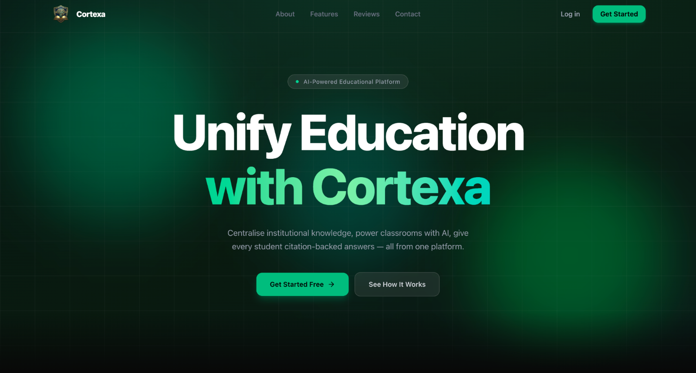

### 2. Login / Authentication

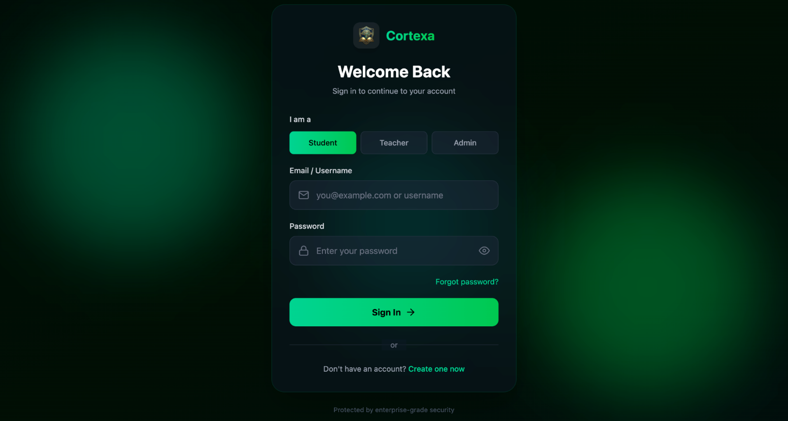

### 3. Institution Dashboard

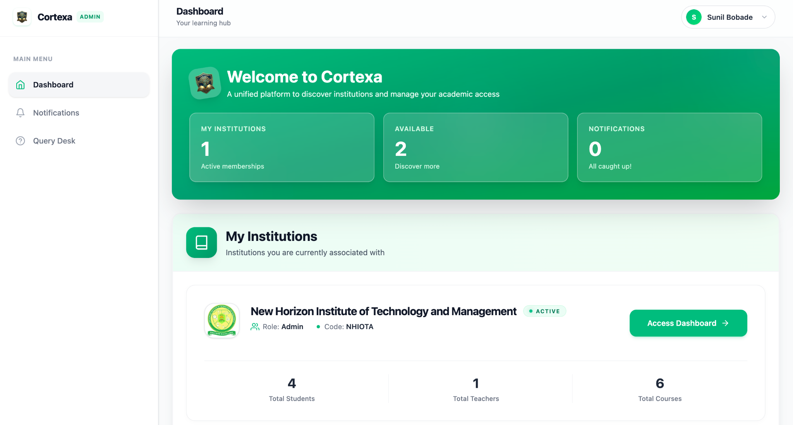

### 4. Upload Notes Module

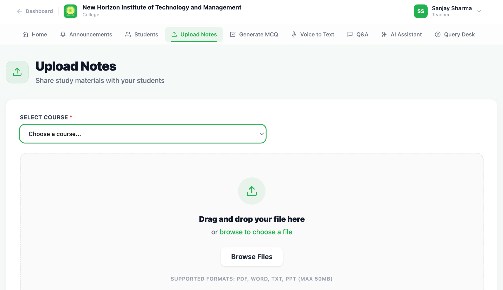

### 5. RAG Chatbot

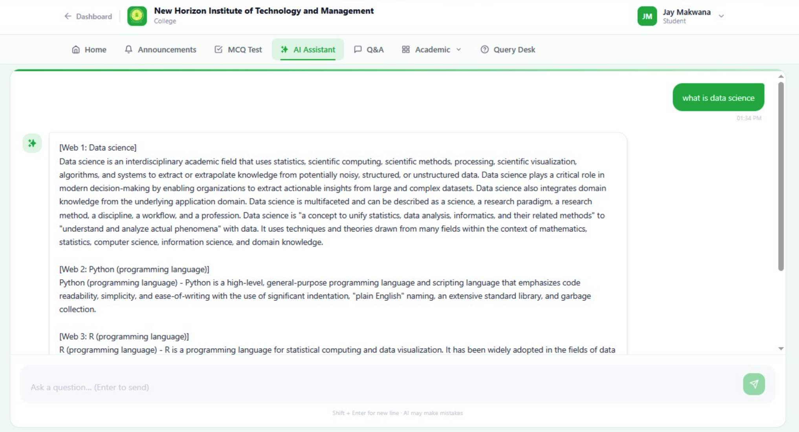

### 6. MCQ Generator

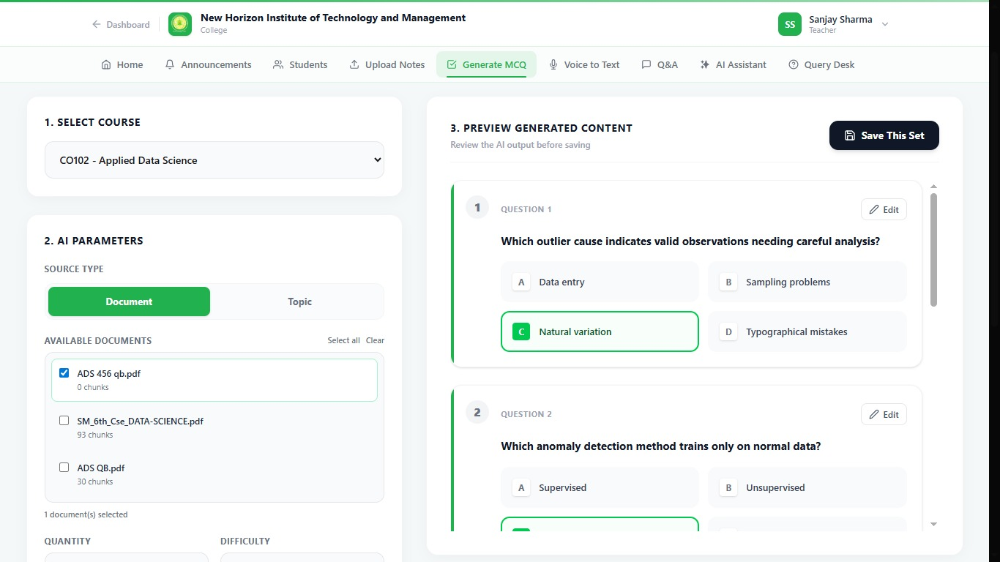

<p align="center">
  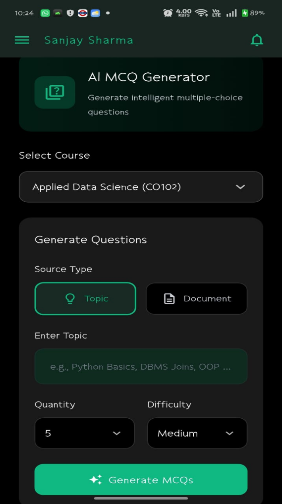
</p>

### 7. Voice to Text

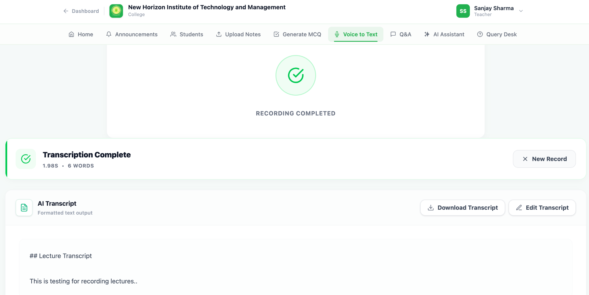

<p align="center">
  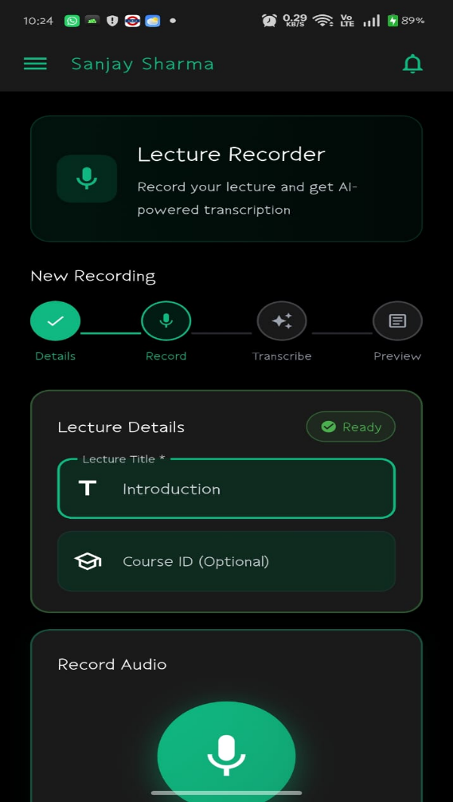
</p>

### 8. Academic Structure


### 9. Manage Users

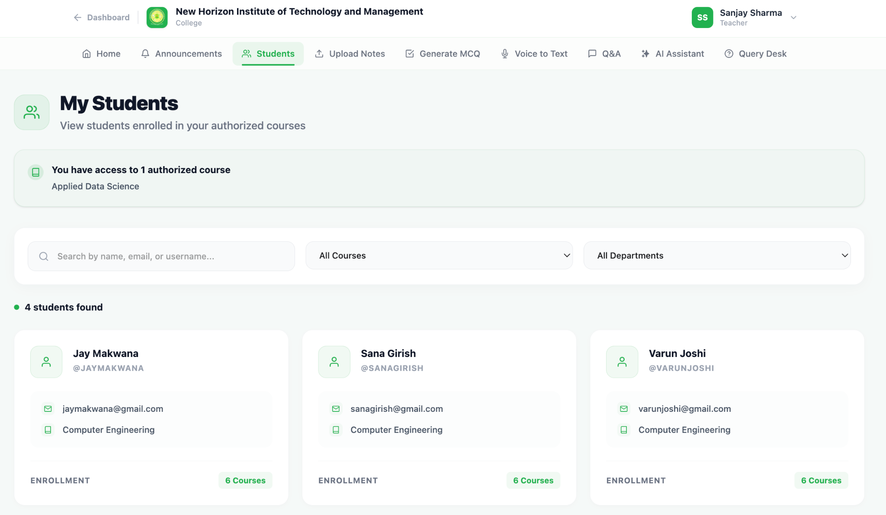

***

## 🏗️ Architecture

```text
User Browser
   │
   ▼
Frontend (React + Vite)
   │
   ├── Public pages
   ├── Institution pages
   ├── Student modules
   ├── Teacher modules
   └── Admin modules
   │
   ▼
Backend (Node.js + Express)
   │
   ├── Authentication
   ├── Institution management
   ├── Academic management
   ├── Announcements
   ├── Query desk
   ├── MCQ results
   ├── Q&A system
   ├── Socket.IO events
   └── AI proxy routes
   │
   ▼
AI Service (Python + FastAPI)
   │
   ├── Document processing
   ├── Embeddings generation
   ├── Vector retrieval
   ├── Answer generation
   ├── MCQ generation
   ├── MCQ scoring
   └── Speech transcription
   │
   ▼
MongoDB Atlas
```
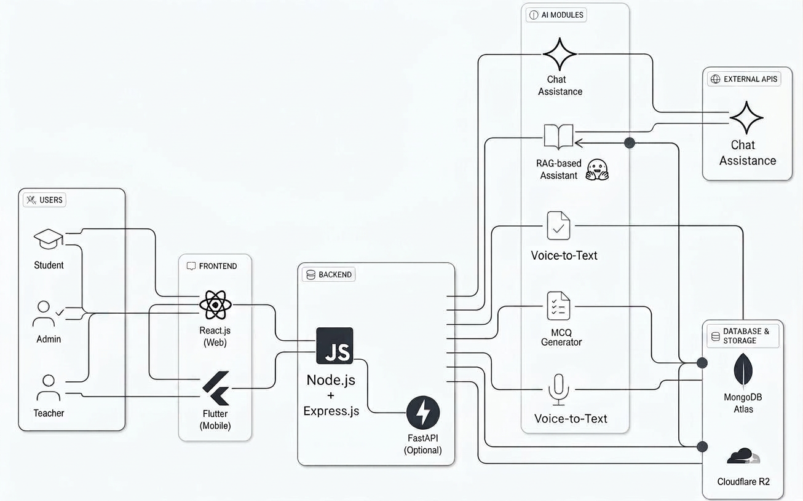

### Why this architecture?

- **Frontend** focuses only on user experience and interaction.
- **Backend** handles business rules, auth, permissions, routes, and DB writes.
- **AI Service** handles all heavy ML/AI work in Python where the best AI libraries exist.
- This separation keeps the project scalable, maintainable, and easier to deploy.

***

## 🛠️ Tech Stack

### Frontend
- React 19
- Vite
- React Router DOM
- TailwindCSS
- DaisyUI
- Axios
- Framer Motion
- Socket.IO Client
- Lucide React
- React Hot Toast

### Backend
- Node.js
- Express
- MongoDB + Mongoose
- JWT Authentication
- bcryptjs
- Socket.IO
- Multer
- AWS SDK / S3 utilities
- Axios

### AI Service
- Python
- FastAPI
- TinyLlama
- sentence-transformers MiniLM
- Whisper tiny
- PyMuPDF
- python-docx
- NumPy
- PyMongo

***

## 📁 Project Structure

```text
cortexa/
├── frontend/
│   └── src/
│       ├── App.jsx
│       ├── main.jsx
│       ├── socket.js
│       ├── context/
│       ├── pages/
│       ├── components/
│       ├── layout/
│       ├── services/
│       ├── config/
│       └── ui/
│
├── backend/
│   ├── app.js
│   ├── server.js
│   ├── routes/
│   ├── models/
│   ├── controllers/
│   ├── middleware/
│   ├── services/
│   ├── api/
│   └── utils/
│
├── ai/
│   ├── api/
│   ├── rag/
│   ├── mcq/
│   ├── speech/
│   ├── vectordb/
│   ├── hybrid/
│   ├── models/
│   ├── tests/
│   ├── config.py
│   ├── main.py
│   ├── start.py
│   ├── requirements.txt
│   └── Dockerfile
│
└── app/
    └── cortexa/
        ├── android/
        ├── assets/
        ├── pubspec.yaml
        ├── pubspec.lock                
        ├── analysis_options.yaml       
        └── lib/
            ├── main.dart               
            ├── routes/                 
            ├── core/
            │   ├── bloc/               
            │   ├── config/             
            │   ├── constants/          
            │   ├── di/                 
            │   ├── errors/             
            │   ├── network/            
            │   ├── providers/          
            │   ├── services/           
            │   ├── utils/              
            │   └── widgets/            
            └── features/
                ├── splash/             
                ├── auth/               
                ├── dashboard/          
                ├── institution/        
                ├── admin/              
                ├── teacher/           
                ├── student/            
                ├── rag_assistant/      
                └── personal_chat/     

```

***

## 🚀 Getting Started

### Prerequisites

Make sure you have:

- Node.js 18+
- Python 3.10+
- MongoDB Atlas or local MongoDB
- Git

### Clone the repository

```bash
git clone https://github.com/vednav9/cortexa.git
cd cortexa
```

### Install dependencies

#### AI Service
```bash
cd ../ai
pip install -r requirements.txt
```

#### Backend
```bash
cd ../backend
npm install
```

#### Frontend
```bash
cd frontend
npm install
```


***

## ⚙️ Environment Variables

### Backend `.env`

```env
MONGO_URI=mongodb-url
PORT=5000
NODE_ENV=development
JWT_SECRET=key
JWT_EXPIRE=7d
FRONTEND_URL=http://localhost:5173
AI_API_URL=http://localhost:8000
CLOUDFLARE_ACCOUNT_ID=
CLOUDFLARE_S3_API=
CLOUDFLARE_R2_BUCKET_NAME=documents
CLOUDFLARE_R2_PUBLIC_DEVELOPMENT_URL=
CLOUDFLARE_R2_API_TOKEN_NAME=cortexa-upload-token
CLOUDFLARE_R2_TOKEN_VALUE=
CLOUDFLARE_R2_ACCESS_KEY_ID=
CLOUDFLARE_R2_SECRET_ACCESS_KEY=
GEMINI_API_KEY=api-key
```

### Frontend `.env`

```env
VITE_API_URL=http://localhost:5000/api
VITE_SOCKET_URL=http://localhost:5000
VITE_AI_URL=https://jay-10020-cortexa-ai.hf.space
```

### AI Service

The AI service receives the MongoDB URI dynamically through backend headers, so you do not need a dedicated `.env` for the core DB connection if the backend is already configured correctly.

***

## ▶️ Run the Project

Open **three terminals**.

### 1. Start AI Service
```bash
cd ai
uvicorn api.main:app --host 0.0.0.0 --port 8000 --reload
```

### 2. Start Backend
```bash
cd backend
npm run dev
```

### 3. Start Frontend
```bash
cd frontend
npm run dev
```

Then open:

```text
http://localhost:5173
```

***

## 👥 User Roles

| Role | Main Responsibility |
|------|----------------------|
| Cortexa Admin | Manages the overall platform |
| Institution Admin | Manages one institution |
| Teacher | Uploads notes, generates MCQs, transcribes lectures |
| Student | Uses chatbot, takes tests, joins Q&A |

***

## 🤖 AI Capabilities

### 1. RAG Chatbot
The chatbot does not answer randomly. It first searches the uploaded course materials, finds the most relevant chunks, and then generates an answer using that context.

### 2. Document Processing
Uploaded documents are cleaned, split into chunks, embedded into vectors, and stored for semantic retrieval.

### 3. MCQ Generation
Teachers can generate quiz questions from text or uploaded notes with difficulty levels.

### 4. MCQ Scoring
Student answers are matched with stored correct answers and explanations.

### 5. Speech-to-Text
Audio lectures are transcribed using Whisper, formatted into readable notes, and optionally indexed for future chatbot use.

### 6. Hybrid Search
If document confidence is too low, the assistant can fall back to web search logic.

***

## 📡 Real-Time Features

Socket.IO is used for real-time communication.

Examples:
- New announcements can appear instantly.
- Notification badges can update without refreshing.
- Query updates and Q&A interactions can be pushed live.

***

### Suggested deployment flow

1. Deploy **frontend** on Vercel.
2. Deploy **backend** on Vercel.
3. Deploy **AI service** on HuggingFace Spaces or another Python-friendly host.
4. Update frontend and backend environment variables with production URLs.

***

## 🔒 Security Highlights

- JWT-based authentication
- bcrypt password hashing
- Role-based route access
- CORS configuration
- Invitation token system
- Backend-mediated AI access
- MongoDB credentials hidden from browser

***

## 🧭 Future Improvements

- Better analytics dashboard
- More advanced admin insights
- Better transcript editing workflow
- More quiz formats beyond MCQ
- Fine-grained permission controls
- Better reporting and exports

***

## 👨‍💻 Authors

- **Vedant Navthale**  
  GitHub: https://github.com/vednav9  

- **Jay Makwana**  
  GitHub: https://github.com/lisencetoKILL  

- **Varun Joshi**  
  GitHub: https://github.com/Varun311004  


***

## ⭐ Support

If you like this project, star the repository and share it.
